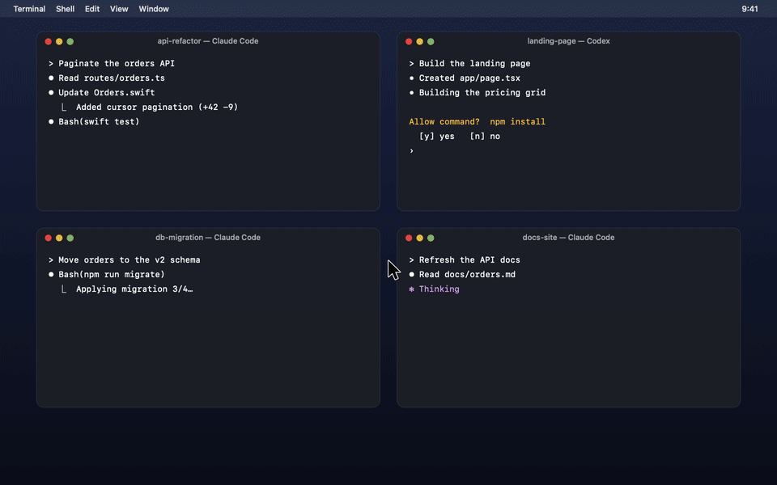
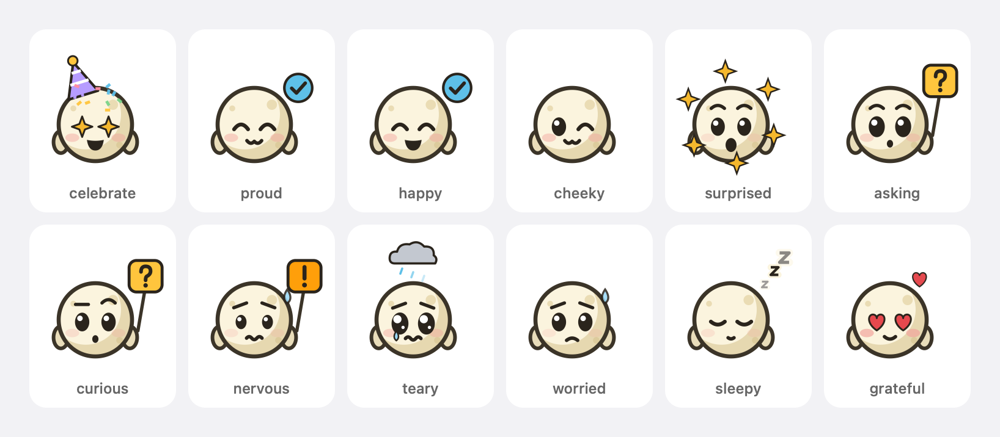

<p align="center">
  
</p>

<h1 align="center">Moonlet</h1>

<p align="center"><strong>Your agents report to your pointer.</strong></p>

<p align="center">
  
  <br>
  <sub><a href="docs/media/moonlet-companion-demo.mp4">Watch in full resolution</a></sub>
</p>

You run several AI coding agents at once. One finished ten minutes ago. Another has waited twenty minutes for a "yes". You only find out when you go looking.

Moonlet stays out of sight while your agents work. When one has something to say, a tiny moon pops out of your pointer with the message, right where you're already looking, and makes a face that fits what was said. Once you've seen it, or answered it, it fades away.

<p align="center">
  <picture>
    <source media="(prefers-color-scheme: dark)" srcset="docs/images/companion-moods-dark.png">
    
  </picture>
</p>

| The agent says | The companion | Your pointer |
| --- | --- | --- |
| "Deployed to production" | Starry eyes, a party hat, confetti | **Blue** |
| "All 14 tests pass" · "Fixed a typo" | Proud · a cheeky wink | **Blue** |
| "Wants to run npm install" · a question | Holds up a yellow **?** sign | **Yellow** |
| "Wants to run rm -rf build/" | Nervous, holding an orange **!** sign | **Yellow** |
| "Staging refused the connection" | Teary, under a little rain cloud | **Red** |
| Nothing: agents are working | Not there at all | Normal arrow |

A card beside it says it in a few words, written by a small model on your Mac. A request card stops in place while it shows, so you can click it to jump to the agent instead of chasing it; answer the agent while it shows, and the companion thanks you. Everything waits for a pause in your typing, holds during calls, and leaves on its own, and an agent still waiting on you comes back at 2, 10, and 30 minutes. Draw a small circle with your pointer, or press <kbd>⌃⌥M</kbd>, to see every agent at once: the ones that need you sit closest to the middle.

## Install

```bash
git clone https://github.com/Abdulaziz-almoshen/moonlet.git && cd moonlet && make install
```

Open **Moonlet** from `~/Applications`, then choose **Connect Claude Code…** and **Connect Codex…** from the crescent in the menu bar. Each change is previewed first and backed up. Requires macOS 14+ and Xcode 16+ to build. [Ollama](https://ollama.com) is optional, for summaries.

## Works with

Claude Code · Codex CLI · anything else, through `moonlet emit` ([protocol](docs/PROTOCOL.md))

## Private by design

Moonlet makes no network calls except to Ollama on localhost, and has no telemetry. It reads input *timing* (never which keys), the frontmost app, and whether a camera or microphone is in use. It never reads the screen.

## Learn more

[Design](docs/DESIGN.md) · [Architecture](docs/ARCHITECTURE.md) · [Integrations](docs/INTEGRATIONS.md) · [Contributing](CONTRIBUTING.md) · [Security](SECURITY.md)

## License

MIT. The pointer artwork is adapted from [Cua](https://github.com/trycua/cua) (MIT); see the [notices](THIRD_PARTY_NOTICES.md).
