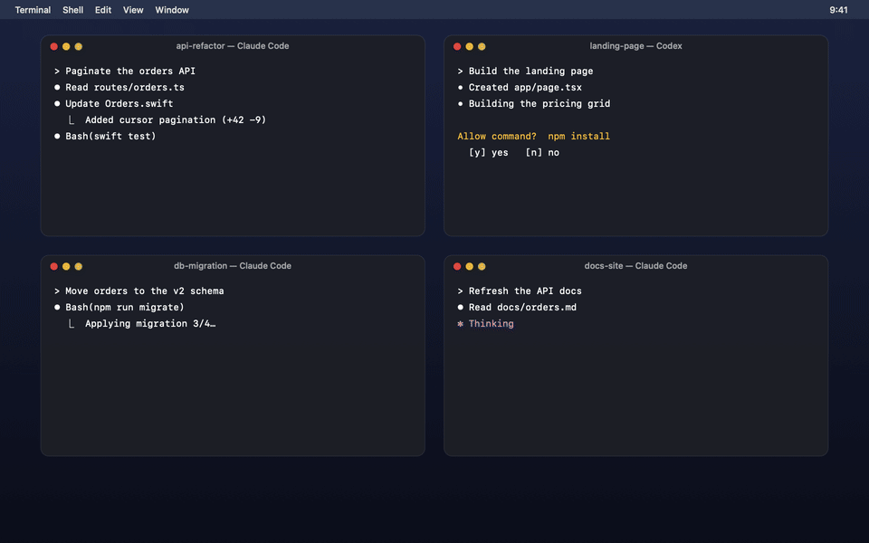
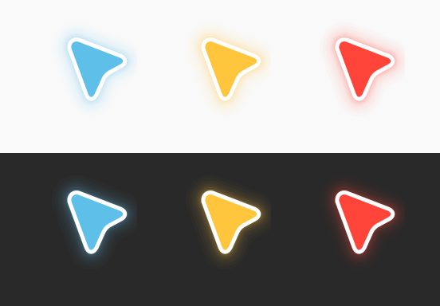

<p align="center">
  
</p>

<h1 align="center">Moonlet</h1>

<p align="center"><strong>Your agents report to your pointer.</strong></p>

<p align="center">
  
  <br>
  <sub><a href="docs/media/moonlet-demo.mp4">Watch in full resolution</a></sub>
</p>

You run several AI coding agents at once. One finished ten minutes ago. Another has waited twenty minutes for a "yes". You only find out when you go looking.

Moonlet stays out of sight while your agents work. When one has something to say, your pointer says it, right where you're already looking.

<p align="center">
  
</p>

| Your pointer | Means |
| --- | --- |
| **Blue** | An agent tells you something, such as "I'm done" |
| **Yellow** | An agent asks you something: a question or a permission |
| **Red** | Something went wrong |
| Normal arrow | Agents are working; nothing needs you |

A card at the pointer says it in a few words, such as `Wants to run npm install` or `Pagination shipped, 14 tests pass`. A small model on your Mac writes them. Cards wait for a pause in your typing, hold during calls, and leave on their own. Draw a small circle with your pointer, or press <kbd>⌃⌥M</kbd>, to see every agent at once.

## Install

```bash
git clone https://github.com/Abdulaziz-almoshen/moonlet.git && cd moonlet && make install
```

Open **Moonlet** from `~/Applications`, then choose **Connect Claude Code…** and **Connect Codex…** from the crescent in the menu bar. Each change is previewed first and backed up. Requires macOS 14+ and Xcode 16+ to build. [Ollama](https://ollama.com) is optional, for summaries.

## Works with

Claude Code · Codex CLI · anything else, through `moonlet emit` ([protocol](docs/PROTOCOL.md))

## Private by design

Moonlet makes no network calls except to Ollama on localhost, and has no telemetry. It reads input *timing* (never which keys), the frontmost app, and whether a camera or microphone is in use. It never reads the screen.

## Learn more

[Design](docs/DESIGN.md) · [Architecture](docs/ARCHITECTURE.md) · [Integrations](docs/INTEGRATIONS.md) · [Contributing](CONTRIBUTING.md) · [Security](SECURITY.md)

## License

MIT. The pointer artwork is adapted from [Cua](https://github.com/trycua/cua) (MIT); see the [notices](THIRD_PARTY_NOTICES.md).
