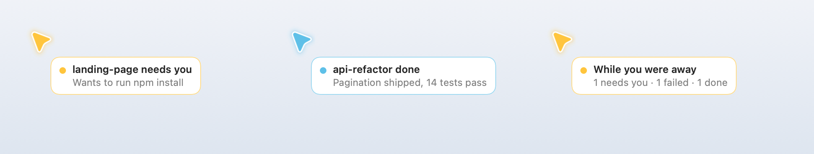
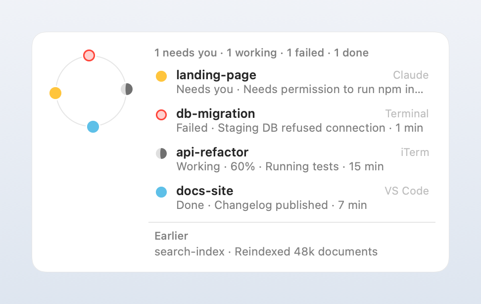

# Design

Moonlet answers one question without asking for your attention: *does any agent need me, and did anything finish?* This document explains the rules behind every card, so contributors can change them deliberately.

## Principles

1. **Invisible by default.** Nothing on screen while agents work. Progress and milestones never interrupt.
2. **At the pointer, never in a corner.** Your eyes are where your pointer is, so that's where Moonlet speaks.
3. **The right moment.** A card waits for a pause in your typing, a call to end, or your return.
4. **Never lost.** Anything you might have missed comes back once, as a summary, or lives in the summon view.
5. **No chores.** You never have to do anything to make a card go away. A click is a shortcut, not a requirement.
6. **A few words.** Titles are `label + verb`; details are two to six words from a local model.

## Presence

Moonlet reads only *timing*: seconds since the last key press, click, scroll, or pointer move. It never reads which keys, and it never sees the screen.

| State | Rule | Meaning |
| --- | --- | --- |
| Active | Input in the last 5 s | You're working; a card will be seen soon. |
| Typing | Key press in the last 1.5 s | Don't interrupt mid-sentence. |
| Paused | No input for 5 s to 2 min | Reading or thinking; a card may wait for you. |
| Away | No input for 2 min or more | You left; collect everything for your return. |
| In a call | Camera on, or the microphone in use for 45 s or more | Hold every card until the call ends. |

The microphone needs 45 s of continuous use before it counts as a call, so dictation doesn't silence Moonlet.

## What becomes a card

<picture>
  <source media="(prefers-color-scheme: dark)" srcset="images/cards-dark.png">
  
</picture>

| Moment | Source | Title example | Priority |
| --- | --- | --- | --- |
| Needs you | Permission prompt, `AskUserQuestion`, plan ready for review | `landing-page needs you` | 1 |
| Question | A finished turn whose last message asks you something | `docs-site has a question` | 1 |
| Failed | The agent stopped with an error | `db-migration failed` | 2 |
| Stuck | Working, but no news for 10 minutes | `scraper seems stuck` | 3 |
| Finished | The turn ended | `api-refactor done` | 4 |

A blocked agent's card says exactly what it's waiting for, so you can decide without switching windows: `Wants to run npm install`, `Wants to edit Orders.swift`, `Plan ready: Add pagination`, or the agent's own question with its options (`Which database should the tests use? SQLite · Postgres`). Claude Code follows a permission request with a generic notification a few seconds later; Moonlet treats it as the same request, so it never shows twice.

Milestones (a commit, a task checked off) never become cards. They show up as progress in the summon view.

Only the newest news from each agent is kept, and moments of the same kind that arrive within 1.5 s share one card (`2 agents done · api-refactor, db-migration`).

## A card's life

```
queued ──(not typing, not in a call, not away)──▶ shown at the pointer
   ▲                                                   │
   │                       ┌───────────────────────────┼─────────────────────────────┐
   │                 click anywhere          held its time and           you went away
   │                       │                you used your Mac              (2 min)
   │                       ▼                          ▼                            │
   │                  seen (gone)             seen (flies home)                    │
   └─────────────────────────── welcome-back summary ◀─────────────────────────────┘
```

- **While you're active,** a card stays 4 s (2–5 s in settings), then leaves on its own. A blocked agent's card stays 8 s, because the agent can't continue without you.
- **While you're paused,** the card waits. When you return, it leaves 3 s later.
- **If nobody touched anything** while it showed, it doesn't count as seen; it keeps waiting.
- **Away for 2 minutes:** the card leaves unseen, and everything that happened while you were gone becomes one summary (`While you were away · 1 needs you · 2 done`).
- **Calls** hold everything; one summary follows the call.
- **Blocked agents come back:** a reminder at 2, 10, and 30 minutes (`still needs you · Waiting 12 min`), then silence.
- **Typing patience:** a blocked agent waits at most 3 s for a pause in your typing; everything else waits up to 10 s.

The first three cards that leave on their own fly into the menu bar moon, so you learn where they go. After that, they simply fade.

## Already watching

If an agent finishes a quick task (under a minute) in the app that's in front, you were probably watching it. Moonlet flashes the pointer blue instead of showing a card. Longer tasks always get a card, because you may have switched tabs or sessions in the same app.

## The pointer

The pointer changes only while an agent talks to you. Silent work never changes it.

| Who's talking | Pointer |
| --- | --- |
| Nobody, including while agents work | Standard macOS arrow |
| A card tells you something, such as a finished task | Blue while the card shows |
| An agent asks you something: a question or a permission request | Yellow until you answer |
| A card reports a failure or a stuck agent | Red while the card shows |
| A quick task you just watched finish | A brief blue flash, no card |

A card's color wins while it shows; with no card, an unanswered question keeps the pointer yellow. Colors mean the same thing everywhere: on the pointer, on a card's edge, on the menu bar moon's dot, and on the moons in the summon view, where quietly working agents are gray.

## Summon

<picture>
  <source media="(prefers-color-scheme: dark)" srcset="images/summon-dark.png">
  
</picture>

Two ways to open the summon view, plus **Show all agents** in the menu:

- **Circle:** about one turn of the pointer, between 15 and 160 points across, within 1.2 s, with no button held.
- **Shortcut:** <kbd>⌃⌥M</kbd>, which needs no permissions (Carbon hot keys).

There's deliberately no shake gesture: macOS already uses a shake to locate the pointer, so a shake would open Moonlet by accident.

The view opens centered on where you drew the circle. Each agent is a moon on the orbit; its lit part is the share of its own task list that's done. Rows list blocked agents first, then failed, working, done, and idle. Opening the view counts as seeing everything, and clicking an agent brings its terminal tab or app forward.

## Learning

When you dismiss five finished cards from the same project within a second of their appearing, and never open that project from Moonlet, the summon view asks once whether to collect that project's updates quietly. A "no" is remembered. Nothing is ever changed without asking.

## Summaries

The final message goes to a small instruct model in Ollama with a fixed prompt: at most six words, numbers kept, or `ASK:` plus the question when the message asks the user something. Replies that ramble or think out loud are discarded in favor of the first sentence. A fast local check catches questions instantly, so the pointer turns yellow right away while the model works.
