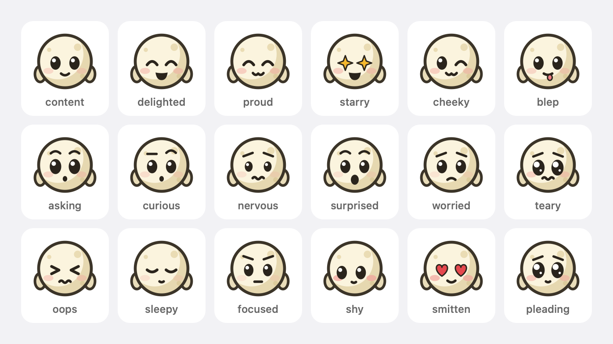

# Design

Moonlet answers one question without asking for your attention: *does any agent need me, and did anything finish?* This document explains the rules behind every card, so contributors can change them deliberately.

## Principles

1. **Invisible by default.** Nothing on screen while agents work. Progress and milestones never interrupt.
2. **At the pointer, never in a corner.** Your eyes are where your pointer is, so that's where Moonlet speaks.
3. **The right moment.** A card waits for a pause in your typing, a call to end, or your return.
4. **Never lost.** Anything you might have missed comes back once, as a summary, or lives in the summon view.
5. **No chores.** You never have to do anything to make a card go away. A click is a shortcut, not a requirement.
6. **A few words.** Titles are `label + verb`; details are two to six words from a local model.

## Presence

Moonlet reads only *timing*: seconds since the last key press, click, scroll, or pointer move. It never reads which keys, and it never sees the screen.

| State | Rule | Meaning |
| --- | --- | --- |
| Active | Input in the last 5 s | You're working; a card will be seen soon. |
| Typing | Key press in the last 1.5 s | Don't interrupt mid-sentence. |
| Paused | No input for 5 s to 2 min | Reading or thinking; a card may wait for you. |
| Away | No input for 2 min or more | You left; collect everything for your return. |
| In a call | Camera on, or the microphone in use for 45 s or more | Hold every card until the call ends. |

The microphone needs 45 s of continuous use before it counts as a call, so dictation doesn't silence Moonlet.

## What becomes a card

<picture>
  <source media="(prefers-color-scheme: dark)" srcset="images/cards-dark.png">
  
</picture>

| Moment | Source | Title example | Priority |
| --- | --- | --- | --- |
| Needs you | Permission prompt, `AskUserQuestion`, plan ready for review | `landing-page needs you` | 1 |
| Question | A finished turn whose last message asks you something | `docs-site has a question` | 1 |
| Failed | The agent stopped with an error | `db-migration failed` | 2 |
| Stuck | Working, but no news for 10 minutes | `scraper seems stuck` | 3 |
| Finished | The turn ended | `api-refactor done` | 4 |

A blocked agent's card says exactly what it's waiting for, so you can decide without switching windows: `Wants to run npm install`, `Wants to edit Orders.swift`, `Plan ready: Add pagination`, or the agent's own question with its options (`Which database should the tests use? SQLite · Postgres`). Claude Code follows a permission request with a generic notification a few seconds later; Moonlet treats it as the same request, so it never shows twice.

Milestones (a commit, a task checked off) never become cards. They show up as progress in the summon view.

Only the newest news from each agent is kept, and moments of the same kind that arrive within 1.5 s share one card (`2 agents done · api-refactor, db-migration`).

## A card's life

```
queued ──(not typing, not in a call, not away)──▶ shown at the pointer
   ▲                                                   │
   │                       ┌───────────────────────────┼─────────────────────────────┐
   │                 click anywhere          held its time and           you went away
   │                       │                you used your Mac              (2 min)
   │                       ▼                          ▼                            │
   │                  seen (gone)             seen (flies home)                    │
   └─────────────────────────── welcome-back summary ◀─────────────────────────────┘
```

- **While you're active,** a card stays 4 s (2–5 s in settings), then leaves on its own. A blocked agent's card stays 8 s, because the agent can't continue without you.
- **While you're paused,** the card waits. When you return, it leaves 3 s later.
- **If nobody touched anything** while it showed, it doesn't count as seen; it keeps waiting.
- **Away for 2 minutes:** the card leaves unseen, and everything that happened while you were gone becomes one summary (`While you were away · 1 needs you · 2 done`).
- **Calls** hold everything; one summary follows the call.
- **Urgent news cuts in:** a failure, question, or permission request takes the pointer from a less urgent card. A card that already showed for its full time counts as seen; otherwise it comes back afterwards.
- **Blocked agents come back:** a reminder at 2, 10, and 30 minutes (`still needs you · Waiting 12 min`), then silence.
- **Typing patience:** a blocked agent waits at most 3 s for a pause in your typing; everything else waits up to 10 s.

The first three cards that leave on their own fly into the menu bar moon, so you learn where they go. After that, they simply fade.

## Already watching

If an agent finishes a quick task (under a minute) in the app that's in front, you were probably watching it. Moonlet flashes the pointer blue instead of showing a card, and the companion stays out of sight. Longer tasks always get a card, because you may have switched tabs or sessions in the same app.

## The companion

A tiny moon with a face brings every card. It is never on screen while agents work, and never comes out without a message: it pops out of the pointer's tip with a card and fades away when the card goes.

<picture>
  <source media="(prefers-color-scheme: dark)" srcset="images/companion-expressions-dark.png">
  
</picture>

| Moment | Words that decide it | Face and props |
| --- | --- | --- |
| Celebrate | deployed, shipped, released, merged, published, is live | Starry eyes, party hat, confetti, a spin |
| Proud | pass, green, all 14, faster | Happy eyes, a check badge, humming |
| Cheeky | typo, lint, whitespace, one-liner, nit, small fix | A wink, sticks out its tongue |
| Surprised | found 3 more, unexpected | Wide eyes, sparkles |
| Happy | any other good news | A hop and a check badge |
| Grateful | thanks | Heart eyes, a heart |
| Asking | a permission request | Holds up a yellow **?** sign |
| Curious | a question, often with options | A yellow **?** sign, glancing between the options |
| Nervous | a request to `rm -rf`, force-push, `sudo`, touch production | An orange **!** sign, fidgeting, a sweat drop |
| Teary | a failure | Glossy eyes, a rolling tear, a little rain cloud |
| Sleepy | rate limit, quota, overloaded | Yawns, z's |
| Worried | no news for 10 minutes, or finished work that reports a problem | Worried brows, a sweat drop |

The kind of moment picks the family (a request, bad news, good news) and the words pick the mood within it. Finished work is read for bad news first: if it says something failed, couldn't be done, isn't merged yet, regressed, dropped, or is missing, the companion is worried (sleepy for a rate limit) and never celebrates, so a failed deploy is never read as a celebration. Good news that names a bad word, such as `no errors` or `fixed 3 lint errors`, stays good news. Only what the agent said counts, never an agent's or project's name, and only its first 500 characters.

- **Never the same twice.** Each mood has its own entrance; the good-news moods (celebrate, proud, happy, cheeky) have two and never play the same one twice in a row. While the card shows, the companion picks small moves at random (a hop, humming, a wave, a glance at you), never repeating the last. About one appearance in seven adds a surprise: a sneeze of sparkles, a spin, a blush.
- **It feels you move.** It rides a spring behind the pointer, leans into turns, stretches when you move fast, and holds on tight when you fling the pointer across the screen. Its eyes follow the pointer. It always stays on the pointer's screen: near the right edge it rides on the pointer's left, and near the bottom edge above the tip.
- **Requests stop for you.** A permission or question card shows for exactly as long as the rules in [A card's life](#a-cards-life) say: about 8 s while you're active, longer while you're paused. While it shows, it stops riding with the pointer after a moment and parks, with the companion on its corner, so you can reach it instead of chasing it. It hops as you get close, and if you move far away for a second, it catches up and parks near you again. Click it to open the agent's tab; the companion waves and fades. Once the card has had its time, or you click somewhere else, it fades like any other card, and the reminders at 2, 10, and 30 minutes bring it back.
- **Thanks for answering.** If the agent gets its answer while its card shows, say you typed `y` in its terminal, the companion thanks you, with heart eyes and a heart if you answered within 6 s of the card appearing, or a delighted hop otherwise, then fades. A card for several agents doesn't thank you for answering just one of them. A stuck agent that gets going again, or a session that ends, just fades.
- **A parked card takes a click only on purpose.** It takes input only on its visible box, only once the pointer has rested there for a moment (about 0.15 s), and never within 0.3 s of a scroll; a scroll that still lands on it makes it click-through at once, so the rest of the scroll reaches your app. Everything else the companion shows is click-through, like the pointer.
- **Reduce Motion** turns off the entrances, moves, springs, hops, waves, pops, and glides; looping props such as a tear or z's hold still. The faces and props stay, and leaving is a plain fade.

Turn the companion off with **Settings → Companion brings the cards**, and cards work exactly as they did before it existed: each rides just below and to the right of the pointer, flipping at the screen's edges, never takes a click, doesn't park, and leaves exactly when the rules say. The change applies at once, even to a card on screen.

## The pointer

The pointer changes only while an agent talks to you. Silent work never changes it.

| Who's talking | Pointer |
| --- | --- |
| Nobody, including while agents work | Standard macOS arrow |
| A card tells you something, such as a finished task | Blue while the card shows |
| An agent asks you something: a question or a permission request | Yellow until you answer, for up to 10 minutes; after that, only its reminder cards bring yellow back |
| A card reports a failure or a stuck agent | Red while the card shows |
| A quick task you just watched finish | A brief blue flash; no card, no companion |

A card's color wins while it shows; with no card, an unanswered question keeps the pointer yellow. Colors mean the same thing everywhere: on the pointer, on a card's edge, on the menu bar moon's dot, and on the summon view's Next up card and timeline. The companion's signs follow suit: a yellow **?** for a request or a question, and an orange **!** for a risky request, which still waits on you; red always means something went wrong. In the summon view's well, agents show a face instead of a color: working agents look focused, and finished ones doze off after a while.

## Summon

<picture>
  <source media="(prefers-color-scheme: dark)" srcset="images/summon-dark.png">
  
</picture>

Two ways to open the summon view, plus **Show all agents** in the menu and `moonlet summon`:

- **Circle:** about one turn of the pointer, between 15 and 160 points across, within 1.2 s, with no button held.
- **Shortcut:** <kbd>⌃⌥M</kbd>, which needs no permissions (Carbon hot keys).

There's deliberately no shake gesture: macOS already uses a shake to locate the pointer, so a shake would open Moonlet by accident.

The view opens where you drew the circle and answers one question first: what needs you next.

- **One line on top:** `api-refactor is waiting on you · 6 min`, then `2 working, all done in ~9 min · 1 finished since you looked`. Finish estimates come from how fast each agent has been checking off its own task list.
- **Gravity:** every agent is a little companion with the face of its latest message. Agents waiting on you are pulled closest to the middle, failures sit just outside them, working agents slowly circle further out, and finished ones rest at the edge, dozing off after a while. Each is lit like a moon by its progress: a finished agent is a full moon.
- **Next up:** the most urgent agent with its question, its options, and **Open in iTerm**.
- **Everything else:** one row per agent with a time (`waiting 6 min`, `~4 min left`, `3 min ago`) and a dot when it changed since you last looked. Pointing at an agent makes it say its line while the others turn to look.
- **The last hour:** a timeline with a shape for each kind of moment, covering the whole hour however many agents talked.
- **Keys,** only when you opened it from the keyboard (the shortcut, the menu, or `moonlet summon`): 1–9 open an agent, on the number row or the keypad in any keyboard layout; Return opens Next up; Esc closes. Any other key just closes it, with no beep, and your typing goes back to the app in front. A circle opens it for the mouse only, so your typing never lands in it; its hint then says *click an agent to open*.

Opening the view counts as seeing everything, and clicking an agent brings its terminal tab or app forward.

## Learning

When you dismiss five finished cards from the same project within a second of their appearing, and never open that project from Moonlet, the summon view asks once whether to collect that project's updates quietly. A "no" is remembered. Nothing is ever changed without asking.

## Summaries

The final message goes to a small instruct model in Ollama with a fixed prompt: at most six words, numbers kept, or `ASK:` plus the question when the message asks the user something. Replies that ramble or think out loud are discarded in favor of the first sentence. A fast local check catches questions instantly, so the pointer turns yellow right away while the model works.
